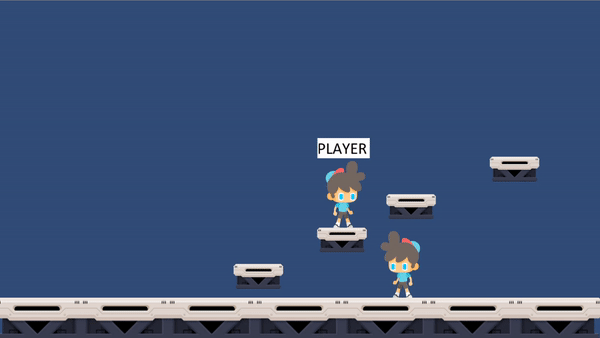

# ObserverPattern

Implementation of achievment system for a 2D game using the Design Patter "Observer".
The project has another one of my design patterns study projects as a base for the character controller using Command Pattern (https://github.com/GQBrendel/CommandPattern)

Based on the book Game Programming Patterns by Robert Nystrom available at:
http://gameprogrammingpatterns.com/

## Setup
This was developed with Unity 2019.3.6f1

This is a Unity project, open it with the correct Unity version and you'll be able to run it.

## Art Sources

Boy: https://www.gameart2d.com/the-boy---free-sprites.html

Platforms: https://www.gameart2d.com/free-sci-fi-platformer-tileset.html

## Output:

